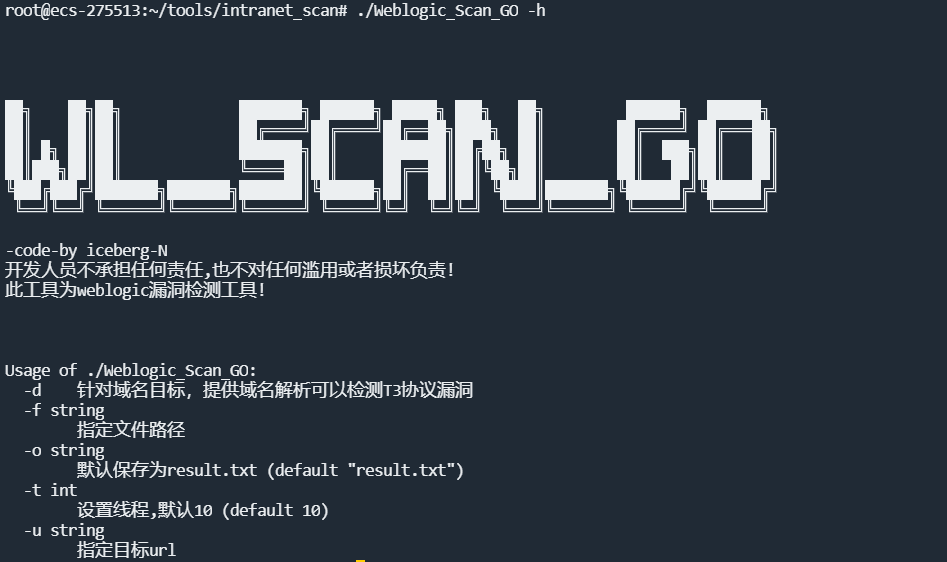
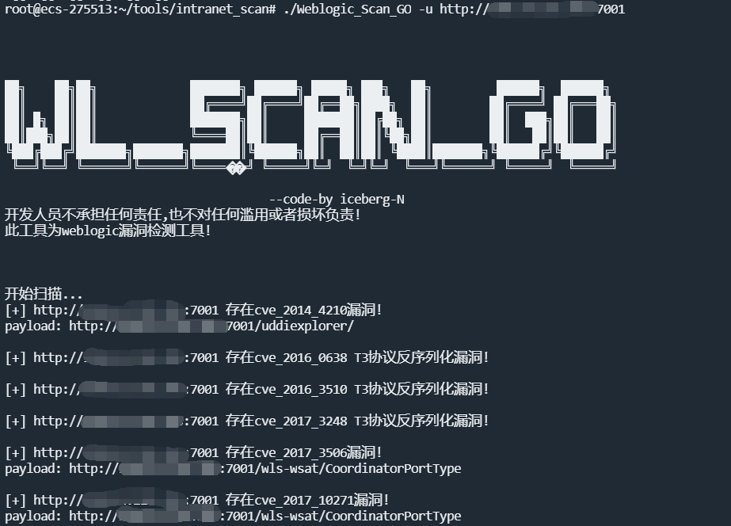
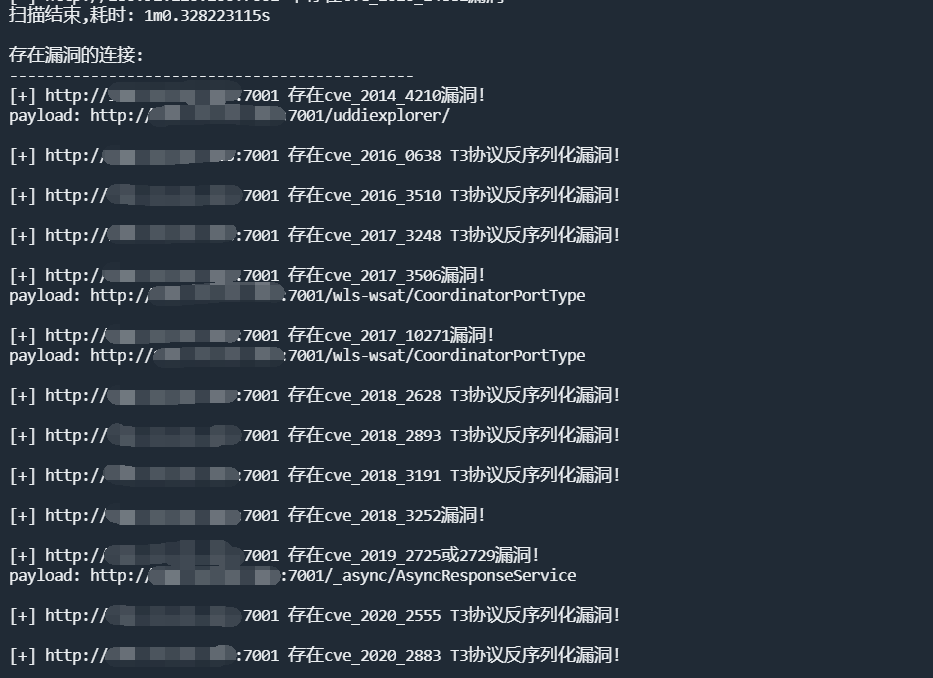
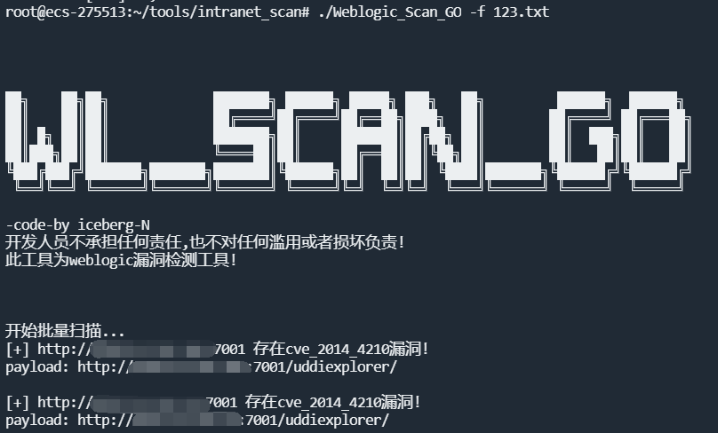

# Weblogic_Scan_GO

----
weblogic漏洞检测工具!!!


# 功能特点
***
**支持漏洞检测**
***
POC种类：
```
check_cve_2014_4210
check_cve_2016_0638
check_cve_2016_3510
check_cve_2017_3248
check_cve_2017_3506
check_cve_2017_10271
check_cve_2018_2628
check_cve_2018_2893
check_cve_2018_2894
check_cve_2018_3191
check_cve_2018_3252
check_cve_2019_2618
check_cve_2019_2725_2729
check_cve_2019_2890
check_cve_2020_2555
check_cve_2020_2883
check_cve_2020_14882
```

# 使用方法

## 环境准备
***
```
git clone https://github.com/iceberg-N/Weblogic_Scan_GO.git
```

## 使用方法
***
-h 提供命令帮助文档


**单个目标**

只有域名，默认为http
```
./WL_Scan_GO -u http://example.com
```





**域名解析**

将域名解析为ip进行扫描
```
./WL_Scan_GO -u http://example.com -d
```

**批量检测**   
批量自动域名解析
支持txt格式,如果没指定输出路径，默认在工具当前目录下生成result.txt
```
./WL_Scan_GO -f ./123.txt
./WL_Scan_GO -f ./123.txt -o ./result.txt
```




# 更多
***
thinkphp5.x的各种版本的漏洞原理及代码分析，请搜索微信公众号"MrHatSec"。
更多红队技巧，请搜索公众号"信安泥石流"。
